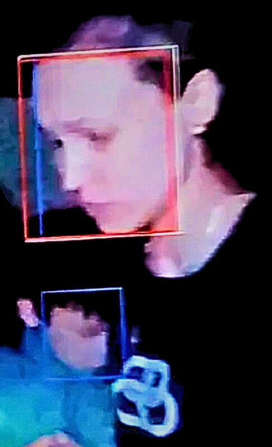

# Video Face Detection for Cross-Video Person Identification



This project processes video footage to detect faces, generate embeddings, and attempt to identify recurring individuals across multiple videos. Originally designed for war journalism, particularly during evacuations and rescue missions, the system helps identify the same individuals in different videos. Through recent optimizations, frame selection and face recognition performance have been improved, and a combination of embedding models and clustering techniques are now used to increase accuracy.

## Features

- **Optimized Frame Selection**: The system intelligently selects frames to avoid redundant processing based on motion detection (optical flow) and brightness checks, improving efficiency without losing critical information.
- **Face detection**: The system extracts faces from video frames using models such as MTCNN and RetinaFace.
- **Combined Face Embeddings**: The system generates face embeddings using multiple models (e.g., VGG-Face, ArcFace, OpenFace, FaceNet) to create a robust high-dimensional vector representation of faces.
- **Cross-video Matching with Hybrid Clustering**: Uses a combination of clustering algorithms like Spectral Clustering, DBSCAN, and Gaussian Mixture Models (GMM) to identify and group similar faces across different videos.
- **Metadata storage**: Detected face images are saved in an organized directory, and corresponding metadata (such as the video source, timestamp, and image path) is logged in a JSON file.

## Frame Selection Optimization

One major optimization is in how the program selects frames to process:

1. **Motion-Based Frame Skipping**: Uses optical flow to detect significant changes in motion between frames. If consecutive frames are too similar, they are skipped.
2. **Brightness-Based Selection**: Analyzes brightness changes across frames, skipping frames with low variation in lighting to avoid redundant face detection in dim scenes.

This reduces unnecessary processing of similar or low-quality frames, improving overall efficiency while retaining important information for face detection.

## Face Embeddings and Clustering

### Face Embeddings

Embeddings are vector representations of faces in a high-dimensional space. Each face is converted into a numerical representation (embedding) by deep learning models, where similar faces will have closer embeddings in this space. The program uses multiple pre-trained models to generate embeddings for more robust face recognition:

- VGG-Face
- OpenFace
- ArcFace
- FaceNet

The embeddings are then normalized and combined, leveraging the strengths of different models to create a more accurate representation of each face.

### Clustering Algorithms

To match faces across different videos, clustering algorithms group embeddings that are close together in the feature space. The system uses a combination of clustering methods to improve the accuracy of identifying recurring faces:

1. **Spectral Clustering**: A graph-based clustering technique that partitions the data into clusters by using eigenvalues of similarity matrices.
2. **DBSCAN (Density-Based Spatial Clustering of Applications with Noise)**: A density-based algorithm that groups closely packed points together, marking outliers as noise.
3. **Gaussian Mixture Model (GMM)**: A probabilistic model that assumes the data is generated from a mixture of several Gaussian distributions.

By combining these algorithms, the system can identify clusters of recurring faces across videos, even in the presence of noise or outliers.

## Requirements

- Python 3.x
- OpenCV
- NumPy
- DeepFace
- Scikit-learn
- Keras (for VGG-Face preprocessing)
- Facenet-PyTorch
- Torch

To install the required packages, use:
```bash
pip install -r requirements.txt
```

## Installation

1. Clone the repository:
   ```bash
   git clone <repository-url>
   ```
2. Install dependencies:
   ```bash
   pip install -r requirements.txt
   ```

## Usage

1. Place your video files in a designated directory.
2. Run the main script:
   ```bash
   python main.py
   ```
3. Detected faces will be saved in the `result/` directory, and metadata is stored in `data.json`.

## Program Structure

- `main.py`: Core script that orchestrates the entire process.
- `face_detect.py`: Handles the detection of faces from video frames using MTCNN and RetinaFace.
- `face_classification.py`: Responsible for generating face embeddings using multiple models and clustering those embeddings to match individuals across videos.
- `data.json`: Logs metadata for each detected face, including image name, video source, and file path.

## Future Improvements

- Further optimization of cross-video matching
- Real-time video processing capabilities
- GPU acceleration for faster analysis
- Enhanced face tracking methods

For questions or contributions, please open an issue or submit a pull request on the project repository.
